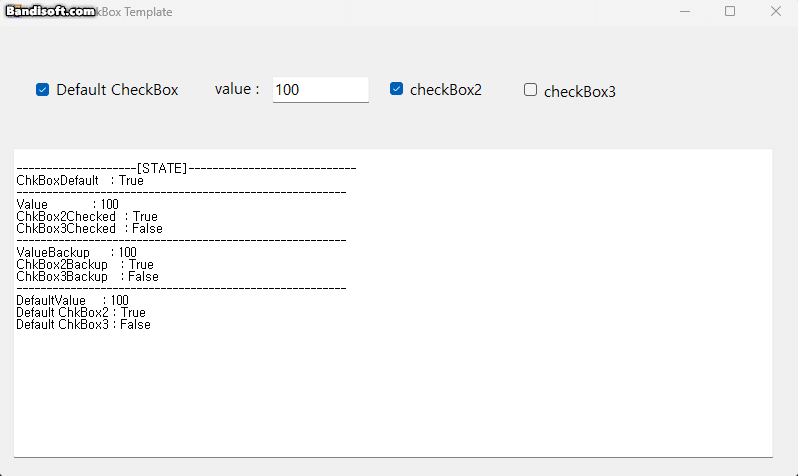

# DefaultCheckBox

## userstory

1. Start with the default checkbox checked and input fields with default values.

2. When the user enters a value in the input component, the default checkbox is unchecked and the last entered value is saved.

3. If you check the default checkbox again, it will be filled with default values.

4. If you uncheck the default checkbox, the last entered value is displayed.

## design pattern

I use Observer pattern for this prgoram.

헤드퍼스트 디자인 패턴 보다가 옵저버 패턴 보는데, 이걸 구현하는데 쓸 수 있을거 같아서 써봤는데
생각보다 찰떡같이 처리되지 않은 것 같아 아쉽습니다. 

## use

 
